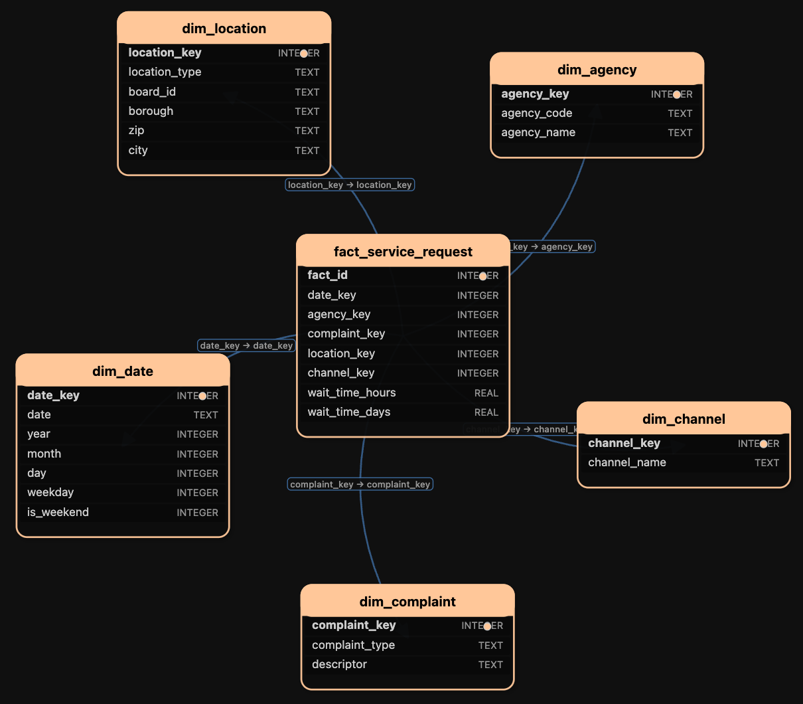

# NYC 311 Service Requests – OLTP and OLAP Pipeline

## Overview

This project implements a complete **OLTP -> Data Warehouse -> OLAP** pipeline using the NYC 311 Service Requests dataset.  

---

## Data Source

- **Dataset:** NYC 311 Service Requests  
- **Provider:** NYC Open Data  
- **Link:** https://data.cityofnewyork.us/Social-Services/311-Service-Requests-from-2010-to-Present/erm2-nwe9  
- **Subset used:**  
  - Agency: NYPD  
  - Status: Closed  
  - Time period: September–December 2025  
  - Size: ~600,000 service requests  

Raw data is **not committed** to the repository and is expected to be downloaded locally.

---

## Project Structure
```
NYC-311-Analysis/
├── Code/
│ ├── 01_DataCollection.py # Data extraction from NYC Open Data
│ ├── 02_OLTP.py # OLTP Database creation
│ ├── 03_DataProcessing.ipynb # OLAP analytical transformations
│ ├── 04_OLAP.py # OLAP Database creation
│ ├── 05_OLAPQuery.py # CLI for custom SQL queries to OLAP (under development)
│
├── Data/ # Local data (gitignored)
│ ├── requests.csv
│ ├── requests_cleaned.csv
│ ├── olap_311.db
│ ├── oltp_311.db
│
├── README.md
├── .gitignore
```

---

## OLTP Database Design

The OLTP layer models the **operational structure** of a 311 service request system using a normalized relational schema implemented in **SQLite**.

### OLTP Tables

- `agency`
- `complaint`
- `borough`
- `park`
- `location`
- `service_request`

Key characteristics:
- Fully normalized (3NF)
- Stores **operational attributes only**

### ER Diagram


---

## OLAP / Data Warehouse Design

The OLAP layer follows a **star schema** optimized for analytical queries.

### Fact Table
- `fact_service_request`
  - Grain: one row per service request
  - Measures:
    - `wait_time_hours` (total duration for service closure in hours)
    - `wait_time_days` (total duration for service closure in days)

### Dimension Tables
- `dim_date`
- `dim_agency`
- `dim_complaint`
- `dim_channel`
- `dim_location`

The location dimension uses an abstracted representation:
- `location_type` 
- `board_id`
- `borough`
- `zip`
- `city`

High-cardinality attributes (adress, street names, landmarks, intersections) are intentionally excluded from the OLAP schema.

### ER Diagram


---

## Data Processing Philosophy

- Missing values are **preserved** since they are semantically meaningful
- No real need for imputation for this data
- Data cleaning focuses on:
  - Logical validation
  - Schema normalization
  - Feature construction for OLAP
- Analytical transformations occur **after querying the OLTP database**

This design aligns with standard data warehousing practices and the principles outlined in *Jiawei Han et al., Data Mining: Concepts and Techniques*.

---

## Technologies Used

- Python
- Pandas
- SQLite
- SQL
- NYC Open Data API

---

## Notes

- Raw data files and database binaries are excluded from version control
- All results can be reproduced by running the provided scripts with the publicly available dataset
- The project is under active development

---

## Author

Nithin V Shenoy
